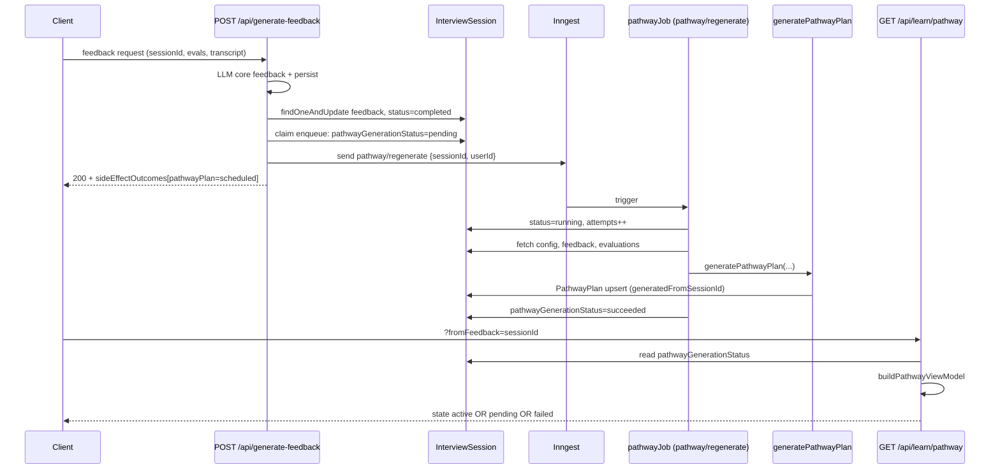

# P0-001 — Pathway not updating after interview

**Status:** confirmed-manual + confirmed-auto (60/60 harness)  
**Symptom:** UI shows “Your pathway update is catching up”; plan content never reflects the new session.

---

## End-to-end flow



---

## State machine (InterviewSession.pathwayGenerationStatus)

| Status | Set by | Meaning |
|--------|--------|---------|
| *(missing)* | — | Never enqueued (legacy or skipped preflight) |
| `pending` | `enqueuePathwayRegeneration` | Event sent (or claimed); job not finished |
| `running` | `pathwayJob` step `mark-running` | Worker picked up job |
| `succeeded` | `pathwayJob` step `mark-completed` | Plan written; terminal |
| `failed` | `pathwayJob.onFailure` or enqueue send error | Terminal; retry CTA |
| `skipped` | `pathwayJob` when flag off | Terminal; no plan generated |

**UI view-model `state: pending`** when `isPendingForFeedback()` is true — i.e. `fromFeedback` session id ≠ `PathwayPlan.generatedFromSessionId` AND status is NOT `succeeded`/`skipped`.

---

## What your QA run proves

| Signal | Value | Implication |
|--------|-------|-------------|
| Analysis Inngest | 60/60 completed | Inngest keys + `/api/inngest` likely OK in prod |
| Pathway view-model | 60/60 `pending` | Status never reached `succeeded`; old plan still shown |
| Feedback | 60/60 scores returned | `generate-feedback` ran; not the blocker |
| Plan items in API | 7 items (stale plan) | `getCurrentPathway` returns **previous** plan while new regen pending |

**Conclusion:** Enqueue likely ran (`pending` set), but **`pathway/regenerate` never completed** (or never started).

---

## Ranked root-cause hypotheses

### H1 — Inngest job never executes (most likely for perpetual `pending`)

- `enqueuePathwayRegeneration` sets `pending` then `inngest.send({ name: 'pathway/regenerate' })`.
- If the worker never runs, status stays **`pending`** forever (no `running`, no `failed`).
- **Check:** Inngest Cloud → Apps → `interview-prep-guru` → Events `pathway/regenerate` → Runs for a QA `sessionId` from `*-sessions.csv`.

### H2 — Job runs but fails before `mark-completed` (would become `failed` after 3 attempts)

- After 3 attempts, `onFailure` → `pathwayGenerationStatus: failed` + retry CTA.
- Your manual UAT shows **catching up**, not **failed** → less likely unless status reads are wrong.

### H3 — `FEATURE_FLAG_PATHWAY_PLANNER=false` in Vercel

- Enqueue skipped entirely → status would stay **missing**, not `pending`.
- Job would mark **`skipped`** if it ran with flag off.
- **Check:** Vercel env `FEATURE_FLAG_PATHWAY_PLANNER` (default true if unset).

### H4 — Enqueue skipped (CAS guard)

- `ENQUEUE_STATUS_FILTER` only allows enqueue when status is `failed` / missing / null.
- If status is already `pending`/`running`/`succeeded`/`skipped`, second enqueue is **silently skipped**.
- A **stuck `pending`** from H1 blocks retry via `/api/learn/pathway/retry` (retry only allows `failed` / missing).

### H5 — Plan upsert / read mismatch (plan “doesn’t update” but status `succeeded`)

- Upsert key: `{ userId, planType: 'standard' }`.
- Read key: `STANDARD_OR_LEGACY_FILTER` (includes legacy docs without `planType`).
- Could show wrong plan if multiple docs exist — but would NOT show perpetual **catching up** (status would be `succeeded`).

### H6 — QA harness poll typo (secondary — does not explain manual UAT)

- Browser runner polled for `pathwayGenerationStatus === 'completed'`.
- Real terminal value is **`succeeded`**, not `completed`.
- Harness always waited full 120s then read pathway while still pending — **inflates pending counts** but manual confirmation is independent.

---

## Investigation checklist (do in order)

### 1. Mongo — pick one QA session

From `qa-browser-full-1779529900005-sessions.csv`, e.g. `6a11441efbba78597b955001`:

```javascript
db.interviewsessions.findOne(
  { _id: ObjectId("6a11441efbba78597b955001") },
  {
    pathwayGenerationStatus: 1,
    pathwayGenerationError: 1,
    pathwayGenerationStartedAt: 1,
    pathwayGenerationCompletedAt: 1,
    pathwayGenerationAttempts: 1,
    completedAt: 1,
    "feedback.overall_score": 1,
  }
)
```

| Field pattern | Diagnosis |
|---------------|-----------|
| `pending`, no `StartedAt` | Event never picked up (H1) |
| `running`, old `StartedAt` | Worker hung mid-job |
| `failed` + error | Read error; use retry CTA |
| `succeeded` | UI/plan mismatch (H5) — check PathwayPlan.generatedFromSessionId |

```javascript
db.pathwayplans.findOne(
  { userId: ObjectId("<userId>") },
  { generatedFromSessionId: 1, generatedAt: 1, planType: 1, "practiceTasks.title": 1 }
).sort({ generatedAt: -1 })
```

### 2. Inngest Cloud

- Filter events: `pathway/regenerate`
- Match `sessionId` from step 1
- **No run** → H1 (sync, keys, or function registration)
- **Failed run** → open trace; check `fetch-session`, `generate-plan` steps
- **Completed run** but Mongo still `pending` → status write bug (unlikely)

### 3. Vercel logs (generate-feedback)

Search for session id:

- `pathway/regenerate enqueued` → enqueue OK
- `pathway/regenerate enqueue skipped — session already pending` → H4
- `Pathway plan regeneration enqueue failed` → inngest.send error

### 4. Production env

- `INNGEST_EVENT_KEY` + `INNGEST_SIGNING_KEY` set (analysis works → likely yes)
- `FEATURE_FLAG_PATHWAY_PLANNER` not `false`

---

## Code map (where to fix)

| Step | File |
|------|------|
| Enqueue gate + send | `modules/learn/services/pathwayRegeneration.ts` |
| Feedback triggers enqueue | `app/api/generate-feedback/route.ts` (~L1488–1499) |
| Background job | `modules/learn/jobs/pathwayJob.ts` |
| Inngest registration | `app/api/inngest/route.ts` |
| Plan write | `modules/learn/services/pathwayPlanner.ts` (`generatePathwayPlan`) |
| Pending UI | `modules/learn/services/pathwayViewModel.ts` (`isPendingForFeedback`) |
| Retry (failed only today) | `app/api/learn/pathway/retry/route.ts` |

---

## Recommended fixes (after confirming H1/H4)

1. **Stale pending recovery** — if `pending`/`running` for >10 min, surface `failed` + retry (mirror analysis `STALE_PENDING_CUTOFF_MS` in `app/api/analysis/start/route.ts`).
2. **Extend retry route** — allow reclaim when pending is stale (CAS filter currently excludes `pending`).
3. **Harness** — poll for `succeeded`/`failed`, capture `pathwayGenerationStatus` in QA JSON.
4. **Ops** — re-sync Inngest app if `pathwayJob` missing from function list.

---

## Link to report structure

- Finding **P0-001** in `modules/qa/config/reportFindings.json`
- Session rollup: `*-sessions.csv` column `pathwayState`
- Scorecard §4.4 in generated `*.md`

---

## 2026-05-22 — Pathway loader / poll / unchanged plan (shipped in repo)

| Change | Location |
|--------|----------|
| Eligibility (`<3` answers, no scored feedback, in-flight poll) | `modules/learn/services/pathwayUpdateEligibility.ts` |
| Enqueue gate `answeredCount >= 3` | `canEnqueuePathwayRegeneration` in `pathwayRegeneration.ts` + all `generate-feedback` enqueue sites |
| GET exposes `pathwayUpdate` + `unchanged` view state | `app/api/learn/pathway/route.ts`, `pathwayViewModel.ts` |
| Client poll 3s × 120s, then Retry CTA | `usePathwayGenerationPoll.ts`, `PathwayPendingBanner.tsx` |
| Recovery A/B/C banners | `PathwayUnchangedBanner.tsx` (retake / open feedback / planner off) |
| Retry: block `<3` answers; reclaim pending stuck ≥2 min | `app/api/learn/pathway/retry/route.ts` (`PATHWAY_CLIENT_STUCK_MS`) |
| Feedback page poll + gate `?retryPathway=1` | `app/feedback/[sessionId]/page.tsx` |

**QA expectation after deploy:** coding/system-design cells with feedback 400 should show `unchanged` (not perpetual pending). Eligible text-depth cells should poll then succeed or offer Retry at 120s.
