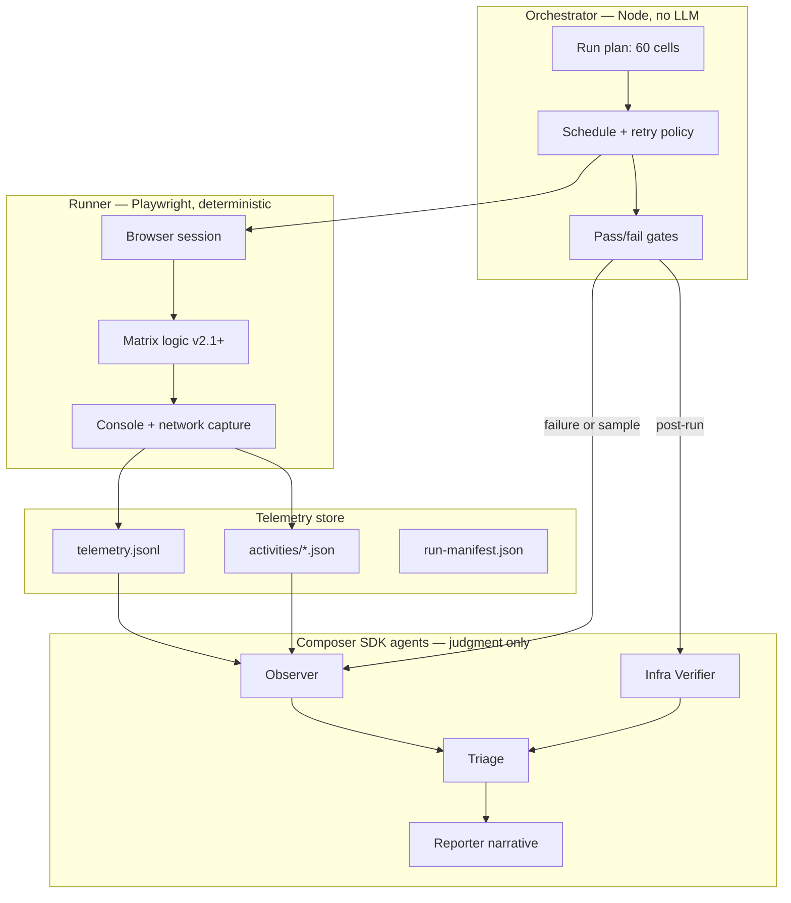

# QA Agent v3 — Multi-Agent Architecture Plan

Status: **Phase 4 in progress** · Baseline: `qa-browser-full-1779529900005` · See also: `FULL_PLAN.md`

---

## 1. Goals

| Goal | Success metric |
|------|----------------|
| **Observe every activity** | Console + network captured after each API step, not just final JSON |
| **Separate signal from noise** | Harness artifact vs product bug vs infra failure — auto-tagged with evidence |
| **Run unattended overnight** | No bookmarklets; Playwright + auth session; resume on crash |
| **Actionable reports** | Findings link to telemetry files; diff vs previous baseline |
| **Cost-controlled LLM use** | Deterministic runner; SDK agents only on failures + sample audit |

## Non-goals (v3)

- Replacing human P0 sign-off before release
- LLM-judging every eval row (180+ calls per run)
- Linear ticket sync (optional; skipped in current rollout)

---

## 2. Architecture overview



**Principle:** The **Runner never calls an LLM**. All API calls, polls, and assertions are code. SDK agents consume **artifacts** and produce **verdicts**.

---

## 3. Agent roster

### 3.1 Orchestrator (Node script — not an SDK agent)

**Role:** Job control, state machine, retries, budget limits.

**Responsibilities:**
- Load run config (`mode: full | smoke`, `questions: 3`, `baseUrl`, `baselineReportId`)
- Iterate matrix cells (domain × depth × persona)
- Invoke Runner for one cell or one full matrix
- On cell failure: retry once (flake guard), then enqueue Observer
- Track quota (stop on 402/403)
- Write `run-manifest.json` (progress, timestamps, sessionIds)
- Exit codes: 0 pass, 1 orchestrator error, 2 run failures exceeded threshold

**File:** `modules/qa/orchestrator/runMatrix.ts`

---

### 3.2 Runner (Playwright — deterministic)

**Role:** Execute product APIs in authenticated browser context; emit telemetry.

**Responsibilities:**
- Launch Chromium with `storageState` (prod QA account)
- Inject or navigate to matrix runner (prefer served `/qa/runner` page long-term; v3.0 can `page.addScriptTag` with `qa-matrix-runner.js`)
- After **each activity** (see §4): flush console ring + network HAR slice → write `activities/<activityId>.json`
- Append summary line to `telemetry.jsonl`
- On run complete: write `matrix-report.json` (same schema as v2 + `telemetryIndex`)

**File:** `modules/qa/runner/playwrightMatrix.ts`

**Browser hooks:**
```typescript
page.on('console', …)           // all levels; filter [QA] vs errors
page.on('response', …)            // url.includes('/api/')
page.on('requestfailed', …)     // network errors
page.on('pageerror', …)           // uncaught exceptions
```

---

### 3.3 Observer (Composer SDK — per failure + 5% sample)

**Role:** Explain *why* an activity failed using console + network context.

**Trigger:**
- Any activity with `verdict: fail`
- Random 5% of `verdict: pass` (audit for silent failures)

**Input:** `activities/<activityId>.json` + relevant code pointers (optional GitNexus context)

**Output:** `observations/<activityId>.json`
```json
{
  "activityId": "frontend/behavioral/strong/q0/generate-question",
  "classification": "product-bug | harness-artifact | infra | flaky | inconclusive",
  "severity": "P0 | P1 | P2 | none",
  "summary": "…",
  "evidence": ["POST /api/… 503", "console: TypeError …"],
  "suggestedNextSteps": ["…"],
  "agentId": "…",
  "runId": "…"
}
```

**SDK pattern:** `Agent.prompt` one-shot per activity (parallelism capped at 3) OR `Agent.create` batch session for one matrix run.

**File:** `modules/qa/agents/observer.ts`

**Model:** `composer-2.5` (fast); escalate to stronger model only if `inconclusive`.

---

### 3.4 Infra Verifier (Node + optional SDK — post-run)

**Role:** Cross-check harness signals against source-of-truth systems.

**Deterministic checks (no LLM):**
| Check | Source | Fail if |
|-------|--------|---------|
| Pathway worker exists | Inngest API / dashboard scrape | < 8 functions or missing `pathway-regenerate` |
| Orphan pathway events | Inngest events API | `pathway/regenerate` events with 0 runs |
| Session pathway status | Mongo batch query | `pending` + `startedAt: null` + age > 5min |
| Analysis jobs | Mongo / analysis API | `failed` > 5% |

**LLM optional:** Summarize infra findings for report narrative only.

**File:** `modules/qa/agents/infraVerifier.ts`

**Env:** `MONGODB_URI`, `INNGEST_EVENT_KEY` (read-only queries)

---

### 3.5 Triage (Composer SDK — post-run)

**Role:** Merge Observer + Infra + deterministic assertions into findings register.

**Input:**
- All `observations/*.json`
- Infra verifier report
- Deterministic assertion summary from Runner
- `config/reportFindings.json` (manual entries)
- Previous baseline (`qa-browser-full-<id>.md`)

**Output:**
- Updated findings list (P0 → P2)
- `triage-summary.json` with deduped patterns
- Recommendations: file ticket / re-run cell / ignore harness

**SDK pattern:** Single `Agent.create` + one `send` with structured output schema (JSON).

**File:** `modules/qa/agents/triage.ts`

---

### 3.6 Reporter (Node + optional SDK narrative)

**Role:** Produce human-readable artifacts.

**Deterministic (existing + extended):**
- `generate-qa-browser-report.mjs` — MD, CSV, findings CSV
- New: `*-telemetry-summary.csv` (activity counts, failure rate by stage)
- New: baseline diff section (pathway %, strong pass %, new P0s)

**SDK optional:** §2 executive summary paragraph, sample Q&A excerpts for stakeholders.

**File:** `scripts/generate-qa-browser-report.mjs` + `modules/qa/agents/reporterNarrative.ts`

---

## 4. Activity model

An **activity** is the smallest unit of observability. One API call or one poll iteration = one activity.

### 4.1 Activity IDs

```
{matrixKey}/{stage}/{substep}
```

Examples:
- `frontend/behavioral/strong/interview/q0/generate-question`
- `frontend/behavioral/strong/interview/q0/evaluate-answer`
- `frontend/behavioral/strong/feedback/generate`
- `frontend/behavioral/strong/feedback/poll-3`
- `frontend/behavioral/strong/analysis/start`
- `frontend/behavioral/strong/analysis/poll-12`
- `frontend/behavioral/strong/pathway/poll-5`
- `frontend/behavioral/strong/pathway/get-plan`
- `frontend/behavioral/strong/drill/list`
- `frontend/behavioral/strong/drill/evaluate`

### 4.2 TelemetryBundle schema

```typescript
interface TelemetryBundle {
  activityId: string
  runId: string                    // qa-browser-full-<timestamp>
  matrixKey: string
  stage: 'interview' | 'feedback' | 'analysis' | 'pathway' | 'drill'
  step: string
  timestamp: string
  durationMs: number

  console: Array<{
    level: 'log' | 'warn' | 'error' | 'debug'
    text: string
    timestamp: number
  }>

  network: Array<{
    method: string
    url: string
    status: number | null
    durationMs: number
    failed: boolean
    requestBodyPreview?: string    // first 500 chars
    responseBodyPreview?: string   // first 1000 chars
  }>

  apiResult?: {
    ok: boolean
    status: number
    ms: number
    keys: string[]                 // top-level response keys, not full body
  }

  assertions: Array<{
    id: string
    pass: boolean
    message: string
  }>

  verdict: 'pass' | 'warn' | 'fail'
  sessionId?: string
}
```

### 4.3 Built-in assertions (deterministic)

| Stage | Assertion ID | Rule |
|-------|--------------|------|
| generate-question | `q-nonempty` | `question.length >= 20` |
| generate-question | `q-latency` | `ms < 8000` |
| evaluate-answer | `ev-dims` | relevance, structure, specificity, ownership all finite |
| evaluate-question | `ev-latency` | `ms < 10000` |
| feedback | `fb-score` | `overall_score` present after poll |
| feedback | `fb-pathway-enqueued` | `sideEffectOutcomes.pathwayPlan.status === 'scheduled'` |
| pathway poll | `pw-terminal` | status ∈ succeeded, failed, skipped within 40 polls |
| pathway poll | `pw-succeeded` | status === succeeded (warn if skipped) |
| analysis | `an-complete` | status === completed within 60 polls |
| analysis | `an-timeline` | timeline.length > 0 |
| all | `no-5xx` | no network entry with status >= 500 |
| all | `no-console-error` | no console level error except known allowlist |

---

## 5. Run directory layout

```
modules/qa/output/runs/<reportId>/
  run-manifest.json          # orchestrator state, config, progress
  matrix-report.json         # v2-compatible final report + telemetryIndex
  telemetry.jsonl            # one JSON line per activity (stream-friendly)
  activities/
    frontend__behavioral__strong/
      interview-q0-generate-question.json
      interview-q0-evaluate-answer.json
      …
  observations/              # SDK Observer output (failures + samples)
    …
  infra-report.json          # Mongo/Inngest deterministic checks
  triage-summary.json        # merged findings
  report.md                  # generated
  *-sessions.csv
  *-evaluations.csv
  *-findings.csv
  *-telemetry-summary.csv
```

---

## 6. Orchestration flow (overnight)

```
1. npm run qa:v3:preflight -- --prod
2. npm run qa:v3:matrix -- --mode full --baseUrl https://www.interviewprep.guru
   │
   ├─ Orchestrator loads storageState (auth)
   ├─ For each of 60 cells:
   │    ├─ Runner executes cell → activities/*.json
   │    ├─ On fail: retry once
   │    └─ On fail again: queue Observer job
   ├─ Write matrix-report.json
   │
3. npm run qa:v3:infra -- --reportId <id>
4. npm run qa:v3:observe -- --reportId <id>   # parallel SDK calls, max 3
5. npm run qa:v3:triage -- --reportId <id>
6. npm run qa:v3:report -- --reportId <id>
7. Optional: npm run qa:v3:diff -- --baseline 1779529900005 --current <id>
```

**Resume:** `run-manifest.json` tracks `completedCells[]`. Orchestrator skips done cells on `--resume`.

---

## 7. Composer SDK integration

### 7.1 Package setup

```bash
npm install @cursor/sdk
```

```typescript
// modules/qa/agents/sdkClient.ts
import { Agent } from '@cursor/sdk'

export function createQaAgent(name: string) {
  return Agent.create({
    apiKey: process.env.CURSOR_API_KEY!,
    model: { id: 'composer-2.5' },
    local: { cwd: process.cwd(), settingSources: [] },
    // MCP optional: gitnexus for code context on failures
  })
}
```

### 7.2 When to use SDK vs Node

| Task | Runtime |
|------|---------|
| Matrix execution | Playwright + Node |
| Assertions | Node |
| Mongo/Inngest queries | Node |
| Classify failure root cause | SDK Observer |
| Dedupe patterns → findings | SDK Triage |
| Executive summary prose | SDK Reporter (optional) |

### 7.3 Cost control

| Run type | SDK calls (approx) |
|----------|-------------------|
| Full matrix, all pass | ~15 (5% sample of ~300 activities) |
| Full matrix, 10% fail | ~45 (failures + sample) |
| Worst case (no sample cap) | 300+ — **never do this** |

**Rules:**
- Cap Observer concurrency at 3
- Max 50 Observer calls per run (then batch remainder into one Triage prompt)
- Triage = exactly 1 SDK call per run
- Reporter narrative = 0–1 SDK calls

### 7.4 MCP servers for SDK agents

| Server | Agent | Purpose |
|--------|-------|---------|
| GitNexus | Observer, Triage | Blast radius + code pointers for failed API routes |
| (future) Mongo read-only | Infra | Session pathway fields |

Pass MCP inline on each `send()` — not persisted on resume.

---

## 8. Auth & environments

| Env | Base URL | Auth | Inngest check |
|-----|----------|------|---------------|
| **prod** | interviewprep.guru | `storageState` from manual login | Inngest Cloud API |
| **local** | localhost:3000 | dev session or test user | localhost:8288 |

**Setup once:**
```bash
npx playwright codegen https://www.interviewprep.guru --save-storage=modules/qa/.auth/prod-qa.json
```
Add `modules/qa/.auth/` to `.gitignore`.

---

## 9. Module structure (new files)

```
modules/qa/
  docs/
    QA_AGENT_V3.md              ← this doc
    TONIGHT_RUN.md              ← update for v3 commands
  orchestrator/
    runMatrix.ts
    runManifest.ts
    retryPolicy.ts
  runner/
    playwrightMatrix.ts
    telemetry.ts
    assertions.ts
  agents/
    sdkClient.ts
    observer.ts
    infraVerifier.ts
    triage.ts
    reporterNarrative.ts
  browser/
    qa-matrix-runner.js         ← v2.1 adds activity emit hooks
  config/
    reportFindings.json
    assertions.json             ← allowlists, thresholds
    runProfiles.json            ← full, smoke, ci-smoke
  .auth/                        ← gitignored
  output/runs/                  ← per-run directories

scripts/
  qa-v3-matrix.mjs              ← CLI entry
  qa-v3-observe.mjs
  qa-v3-triage.mjs
  qa-v3-infra.mjs
  qa-v3-report.mjs
  qa-v3-diff.mjs
  generate-qa-browser-report.mjs  ← extend for telemetry
```

---

## 10. Implementation phases

### Phase 3.0 — Telemetry foundation (3–4 days)

- [x] v2.1 harness: `emitActivity()` in `api()`, `QA_TELEMETRY` JSONL
- [x] `modules/qa/runner/telemetry.mjs` + `assertions.mjs`
- [x] Extend report generator: telemetry summary CSV + run artifacts
- [x] Unit tests for assertions.mjs

**Exit criteria:** Each activity produces TelemetryBundle in final JSON.

### Phase 3.1 — Playwright runner (3–4 days)

- [x] Auth setup + `storageState` (`scripts/qa-auth-setup.mjs`)
- [x] Automation login API (`POST /api/qa/automation-login`) — no manual cookie paste
- [x] `playwrightMatrix.mjs` runs matrix via injected harness v2.1
- [x] Per-activity files + Playwright console/network sidecars
- [x] `run-manifest.json` + `--resume` (cell offset merge from partial `matrix-report.json`)
- [x] Per-cell retry (`cellRetry=1`) + quota abort on HTTP 402/403
- [x] CLI `scripts/qa-v3-matrix.mjs` + npm scripts
- [x] `mini-smoke` profile: 3 cells × 6Q × 10min — validated prod (`qa-browser-smoke-1779718960245`)

**Exit criteria:** Overnight prod run with zero bookmarklets.

### Phase 3.2 — Observer agent (2 days)

- [x] `observer.mjs` + `qa-v3-observe.mjs` (rule-based v1)
- [x] `llmObserver.mjs` + `--llm` flag (Anthropic Haiku, cap 50 calls)
- [x] Failure + 5% sample triggers
- [x] `observations/*.json` output
- [x] Wired via `--observe` on `qa-v3-matrix.mjs`

**Exit criteria:** Failed pathway poll auto-classified as infra vs product in observation file.

### Phase 3.3 — Infra verifier (1–2 days)

- [x] Mongo batch pathway status query (`interviewsessions` collection)
- [x] Inngest automated check via `GET /api/inngest` (`inngestCheck.mjs`)
- [x] `infra-report.json`
- [x] Wired via `--infra` on `qa-v3-matrix.mjs`
- [ ] Set `MONGODB_URI_PROD` in `.env.local` for prod pathway verification

**Exit criteria:** P0 pathway would have been caught by infra check even if harness poll typo remained.

### Phase 3.4 — Triage + report (2 days)

- [x] `triage.mjs` merges Observer + Infra + telemetry + manual findings
- [x] `qa-v3-triage.mjs`, `qa-v3-diff.mjs`, `qa-v3-report.mjs` CLI
- [x] `baselineDiff.mjs` — metrics diff vs `qa-browser-full-1779529900005`
- [x] `findingsExporter.mjs` (Linear sync optional — not required for GA)
- [x] Report generator reads `triage-summary.json` + `baseline-diff.json`
- [x] Resolved P0 no longer shown as active ship blockers
- [x] Wired: `--report` runs triage → MD (observe/infra/triage order in matrix CLI)
- [ ] Set `LINEAR_API_KEY` only if enabling `--linear` ticket sync

**Exit criteria:** Single command produces MD + findings with links to activity files.

### Phase 3.5 — UI smoke mode

- [x] `playwrightUiSmoke.mjs` + `qa-v3-ui-smoke.mjs`
- [x] Profile `ui-smoke`: 6 cells, lobby → `/interview`
- [x] Capture `/api/tts/stream` TTFB (budget ≤600ms) + Deepgram WS detection
- [x] npm: `qa:v3:ui-smoke:prod`

**Exit criteria:** UI smoke passes on prod for all 6 smoke cells before full matrix GA.

### Phase 4 — SDK agents + matrix fidelity + GA gate

- [x] `sdkClient.mjs` — `@cursor/sdk` + Anthropic fallback
- [x] `sdkTriage.mjs` — 1 structured call per run (`--sdk` on triage/report)
- [x] `reporterNarrative.mjs` — `narrative.md` (`--narrative` on report)
- [x] Harness **v2.3.0** — real `generate-problem` → `evaluate-code`, `evaluate-design`
- [x] Infra `analysis-failure-rate` batch (Mongo `multimodalanalyses`)
- [x] `qa:v3:gate:prod` — preflight → ui-smoke → mini-smoke
- [ ] UI smoke prod re-validation (TTS budget)
- [ ] Coding/system-design UI smoke (Monaco submit, canvas)
- [ ] Inngest orphan `pathway/regenerate` events check (needs events API creds)
- [ ] First unattended **60-cell prod matrix** (v3 GA)

**Exit criteria:** `npm run qa:v3:gate:prod` green; full matrix completes; SDK triage + narrative in run dir.

---

## 11. Migration from v2

| v2 (now) | v3 |
|----------|-----|
| Inject bookmarklets | Playwright + storageState |
| Final JSON only | Per-activity telemetry |
| Manual triage | Observer + Triage agents |
| `npm run qa:report:browser` | `npm run qa:v3:report` (wraps same generator) |
| `qa-matrix-runner.js` v2.0.0 | v2.2 activity hooks + resume/retry/quota |

**Tonight:** Can still run v2 inject while building 3.0.
**v3 GA:** When Phase 3.1 passes one full unattended prod run.

---

## 12. Success criteria (v3 GA)

| Metric | Target |
|--------|--------|
| Unattended full matrix | Completes without human intervention |
| Activity coverage | 100% of API steps have TelemetryBundle |
| Observer accuracy | Manual review of 10 failures: ≥8 correct classification |
| Pathway P0 detection | Infra verifier flags missing Inngest function before matrix ends |
| SDK cost per run | ≤ 50 Observer calls + 1 Triage |
| Report time | Full report generated < 5 min after matrix completes |
| Baseline diff | Auto-compare to previous run ID |

---

## 13. Risks & mitigations

| Risk | Mitigation |
|------|------------|
| Prod auth session expires mid-run | Preflight checks session; pause with clear error; refresh script |
| SDK cost spike | Hard caps on Observer calls; batch failures |
| Playwright detected as bot | Use headed mode + real session cookies; rate limit between cells |
| Mongo/Inngest creds in CI | Read-only service user; secrets in env only |
| Observer hallucinates root cause | Require evidence[] cite telemetry lines; deterministic assertions win on conflict |

---

## 14. Locked decisions (2026-05-23)

| # | Question | Decision |
|---|----------|----------|
| 1 | Run v2 inject matrix before v3 is ready? | **No — postpone full matrix until v3 multi-agent GA** |
| 2 | Prod auth via Playwright `storageState`? | **Yes** — one-time manual login → `modules/qa/.auth/prod-qa.json` |
| 3 | Composer SDK runtime for Observer/Triage? | **Local machine** (`local: { cwd }`, not cloud agents) |
| 4 | Ticket output from Triage? | **Both** — `*-findings.csv` **and** auto-create Linear issues for P0/P1 |

### Still open (minor)

- Served runner page (`/qa/runner`) vs script inject — decide during 3.1
- Git commit of raw telemetry — default ignore `output/runs/` (keep MD/CSV only)

---

## 14.1 Linear integration (Triage output)

**Trigger:** After `qa:v3:triage`, for each finding with `severity ∈ {P0, P1}` and `status != resolved`.

**Flow:**
```
triage-summary.json
  → findingsExporter.ts   → *-findings.csv (always)
  → linearSync.ts         → create/update Linear issues (P0/P1 only)
```

**Linear issue fields:**

| Field | Source |
|-------|--------|
| Title | `[QA-{severity}] {stage}: {title}` |
| Description | Impact + evidence bullets + links to `activities/*.json` + observation file |
| Priority | P0 → Urgent, P1 → High |
| Labels | `qa-auto`, `{stage}`, `{classification}` |
| Team | Config: `modules/qa/config/linear.json` |

**Dedup:** Before create, search Linear for label `qa-auto` + finding ID in title (e.g. `AUTO-PWY-001`). If exists → add comment with new run evidence, don't duplicate.

**Env:** `LINEAR_API_KEY` or Linear MCP OAuth (Cursor/Codex). Prefer MCP in interactive triage; API key for unattended overnight on local machine.

**P2 / harness-artifact:** CSV row only — no Linear ticket unless `--create-all` flag.

**Config file** (`modules/qa/config/linear.json`):
```json
{
  "teamId": "<linear-team-id>",
  "projectId": "<optional>",
  "createForSeverity": ["P0", "P1"],
  "labels": ["qa-auto"]
}
```

---

## 15. Next action

**Recommended start:** Phase 3.0 (telemetry in harness) — no prod matrix run until Phase 3.1 Playwright runner + 3.4 triage are ready.

**Build order (local machine, SDK local):**
1. Phase 3.0 — telemetry + assertions
2. Phase 3.1 — Playwright + `storageState` auth setup
3. Phase 3.2–3.3 — Observer + Infra verifier
4. Phase 3.4 — Triage + Linear sync + report
5. **First full prod matrix** — v3 GA smoke, then full 60-cell overnight

```bash
# One-time auth (before first v3 run)
npx playwright codegen https://www.interviewprep.guru --save-storage=modules/qa/.auth/prod-qa.json

# After v3 GA
npm run qa:v3:preflight -- --prod
npm run qa:v3:matrix -- --mode full --prod
npm run qa:v3:triage -- --reportId <id>    # CSV + Linear P0/P1
```
